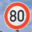
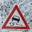

# **Traffic Sign Recognition** 

## Writeup

**Build a Traffic Sign Recognition Project**

The goals / steps of this project are the following:

* Load the data set (see below for links to the project data set)
* Explore, summarize and visualize the data set
* Design, train and test a model architecture
* Use the model to make predictions on new images
* Analyze the softmax probabilities of the new images
* Summarize the results with a written report

### Data Set Summary & Exploration

#### 1. Provide a basic summary of the data set. In the code, the analysis should be done using python, numpy and/or pandas methods rather than hardcoding results manually.

I used the numpy library to calculate summary statistics of the traffic
signs data set:

* The size of training set is 34799
* The size of the validation set is 4410
* The size of test set is 12630
* The shape of a traffic sign image is 32x32x3
* The number of unique classes/labels in the data set is 43

#### 2. Include an exploratory visualization of the dataset.

Here is an exploratory visualization of the data set. It is a bar chart showing how many images of the different traffic sign types are used to train the model.
The lowest number of images of about 180 are used to learn type 0, the highest number of images of about 2000 are used to learn types 1 and 2.

### Design and Test a Model Architecture

#### 1. Describe how you preprocessed the image data. What techniques were chosen and why did you choose these techniques? Consider including images showing the output of each preprocessing technique. Pre-processing refers to techniques such as converting to grayscale, normalization, etc. (OPTIONAL: As described in the "Stand Out Suggestions" part of the rubric, if you generated additional data for training, describe why you decided to generate additional data, how you generated the data, and provide example images of the additional data. Then describe the characteristics of the augmented training set like number of images in the set, number of images for each class, etc.)

As a first step, I decided to convert the images to grayscale because an grayscale image still contains all shape information of the original while image processing requires less computing power due to the reduced number of color planes.

As a second step, I did a histogram equalization of the grayscale images to improve the contrast which should result in better traffic sign recognition results.

Here is an example of a traffic sign image before and after conversion to grayscale and histgram equalization. 
(ATTENTION: The black label "25" in the lower right corner is not part of the image, it is a label drawn by matplotlib!)

I decided to generate additional data because using more data should decrease the risk of overfitting the neural network and should make the model more robust.

To add more data to the the data set, I duplicated the grayscale image set and added black or white noise to the images. This simulates conditions which would exist in case of rain or showfall.

Here is an example of an original image and an augmented image:

Furthermore, I duplicated the grayscale images set again and added "splotches" to the images. The splotches have a fixed size of 8 by 8 pixels and are added at random places. This simulated condition like if the traffic sign is partly hidden by e. g. leafs.

Here is an example of an original image and an augmented image:

After adding the augmented image the training data set 104397 images are used to train the model.
The validation data set and the test data set was not augmented.

#### 2. Describe what your final model architecture looks like including model type, layers, layer sizes, connectivity, etc.) Consider including a diagram and/or table describing the final model.

My final model is similar to the LeNet model and consists of the following layers:

| Layer              |     Description                               | 
|:------------------:|:---------------------------------------------:| 
| Input              | 32x32x1 grayscale image                       | 
| Convolution 5x5    | 1x1 stride, valid padding, outputs 28x28x6    |
| RELU               |                                               |
| Max pooling        | 2x2 stride,  outputs 14x14x6                  |
| Convolution 5x5	   | 1x1 stride, valid padding, outputs 10x10x32   |
| RELU               |                                               |
| Max pooling        | 2x2 stride,  outputs 5x5x32                   |
| Fully connected	   | input 800, output 240                         |
| RELU               |                                               |
| dropout            | keep_prob 0.75                                |
| Fully connected    | input 240, output 150                         |
| RELU               |                                               |
| dropout            | keep_prob 0.75                                |
| Fully connected    | input 150, output 43                          |
| Softmax            | one_hot_y                                     |

#### 3. Describe how you trained your model. The discussion can include the type of optimizer, the batch size, number of epochs and any hyperparameters such as learning rate.

To train the model, I used an AdamOptimizer, a batch size of 192, 50 epochs and a learning rate of 0.0003

#### 4. Describe the approach taken for finding a solution and getting the validation set accuracy to be at least 0.93. Include in the discussion the results on the training, validation and test sets and where in the code these were calculated. Your approach may have been an iterative process, in which case, outline the steps you took to get to the final solution and why you chose those steps. Perhaps your solution involved an already well known implementation or architecture. In this case, discuss why you think the architecture is suitable for the current problem.

I choosed the LeNet model becaused it worked well for recognition of hand-written numbers which are also grayscaled image data were the shapes have to be recognized. After some tests it showed, that LeNet also works for the traffic sign classification.

My final model results were:

* training set accuracy of 0.984
* validation set accuracy of 0.937
* test set accuracy of 0.923
 

### Test a Model on New Images

#### 1. Choose five German traffic signs found on the web and provide them in the report. For each image, discuss what quality or qualities might be difficult to classify.

I downloaded 14 German traffic signs that I found on the web:

 

The fifth image might be difficult to classify because it is one of these mobile traffic signs mounted on a tripod which are used on short-time road works.

#### 2. Discuss the model's predictions on these new traffic signs and compare the results to predicting on the test set. At a minimum, discuss what the predictions were, the accuracy on these new predictions, and compare the accuracy to the accuracy on the test set (OPTIONAL: Discuss the results in more detail as described in the "Stand Out Suggestions" part of the rubric).

The model was able to correctly recognize 14 of the 14 traffic signs, which gives an accuracy of 100%. This is a better accuracy than on the test set of 0.923. 

#### 3. Describe how certain the model is when predicting on each of the five new images by looking at the softmax probabilities for each prediction. Provide the top 5 softmax probabilities for each image along with the sign type of each probability. (OPTIONAL: as described in the "Stand Out Suggestions" part of the rubric, visualizations can also be provided such as bar charts)

The code for making predictions on my final model is located in the 10th code cell of the Ipython notebook.

For all traffic signs, the model is very sure about the signs with a probability of 0.98 and greater. 

